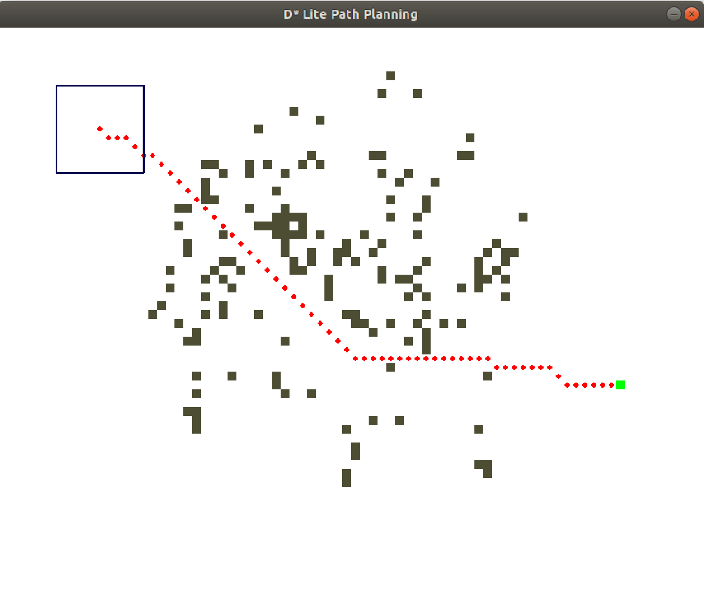
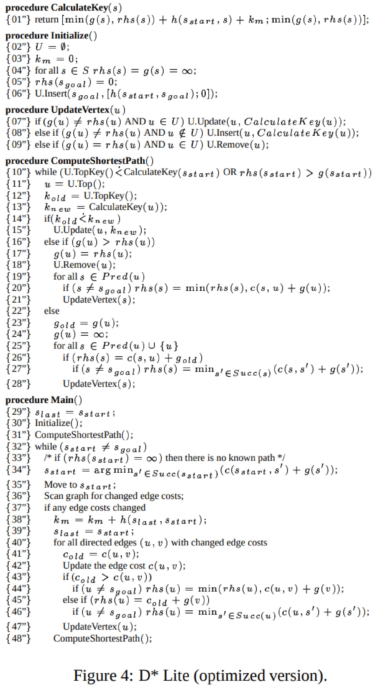

[](https://GitHub.com/Sollimann/Dstar-lite-pathplanner/stargazers/)
[](https://GitHub.com/Sollimann/Dstar-lite-pathplanner/watchers/)
[](https://GitHub.com/Sollimann/Dstar-lite-pathplanner/network/)
# D* Lite incremental pathplanning algorithm for robotics
### Implementation of the D* lite algorithm for pathplanning in Python and eventually also C++
[](https://GitHub.com/Sollimann/Dstar-lite-pathplanner/releases/)
[](https://GitHub.com/Sollimann/Dstar-lite-pathplanner/graphs/contributors/)
[](https://GitHub.com/Sollimann/Dstar-lite-pathplanner/graphs/commit-activity)
[](https://GitHub.com/Sollimann/Dstar-lite-pathplanner/pulls)
[](https://GitHub.com/Sollimann/Dstar-lite-pathplanner/pulls)

[](https://opensource.org/licenses/MIT)




This software is an implementation of the D*-Lite algorithm as explained in [Koenig, 2002](http://idm-lab.org/bib/abstracts/papers/aaai02b.pdf). The D* Lite algorithm was developed by Sven Koenig and Maxim Likhachev for a faster more lightweight alternative to the D* algorithm (developed by Anthony Stentz in 1995). 

## Dependencies
* pip install pygame
* pip install numpy

## install poetry package mananger and virtual env (or use pipenv):
you can use pipenv or [poetry](https://www.pythoncheatsheet.org/blog/python-projects-with-poetry-and-vscode-part-1/) to active virtual env.
```
$ pip install poetry
$ cd /d-star-lite/python
$ poetry install
$ poetry shell
$ python main.py
```

### Commands
* [Space] - move robot along line
* [left click] - place obstacle
* [right click] - remove obstacle
* s_start, s_goal and view range can be changed in main.py

### The cell colors are as follows:
* Red - shortest path
* Green - goal vertex
* grey - obstacle
* white - unoccupied

### idea


The version of D* Lite that I implemented works by bascially running A* search in reverse starting from the goal and attempting to work back to the start. The solver then gives out the current solution and waits for some kind of change in the weights or obstacles that it is presented with. As opposed to repeated A* search, the D* Lite algorithm avoids replanning from scratch and incrementally repair path keeping its modifications local around robot pose.

This is the optimized version as explained in Figure 4 of the paper.

### Main concepts

1. Switched search direction: search from goalto the current vertex. If a change in edge cost is detected during traversal (around the current robot pose), only few nodes near the goal (=start) need to be updated.
2. These nodes are nodes those goal distances have changed or not been caculated before and are relevant to recalculate the new shortest path to the goal.
3. Incremental heuristic search algorithms: able to focus and build upon previous solutions

## Pseudo code, D* Lite optimized version


## References:
Improved Fast Replanning for Robot Navigation in Unknown Terrain<br>
Sven Koenig, Maxim Likhachev<br>
Technical Report GIT-COGSCI-2002/3,<br>
Georgia Institute of Technology, 2002.

